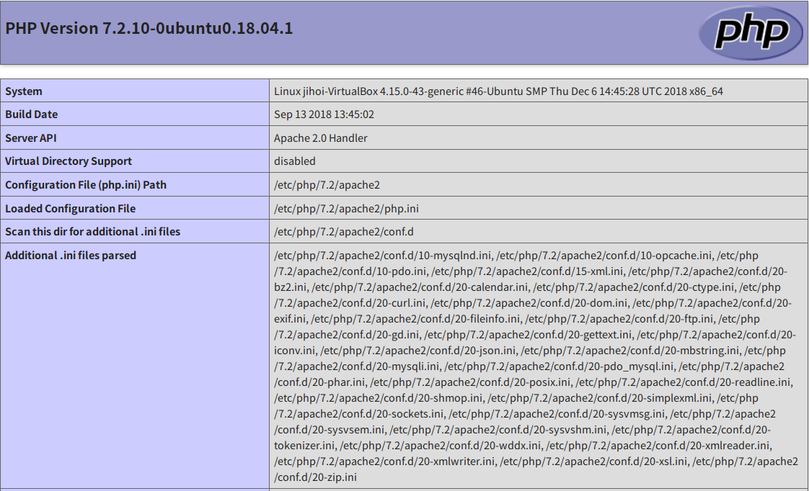

# Coupon-Code-Generator

This is the program to generate coupon.

Language: php >= 7.2

DB schema

*구현한 것과 하지 못한 것들을 구분해 놓았습니다. (o) or (x)

1. 사전준비
    1. 회원 테이블을 생성하고 4명의 유저를 생성해 주세요. (o)
    2. 그 중에 하나는 admin 계정입니다. (o)
=> admin, benjamin, christian, david 계정 존재

2. 로그인 페이지
    1. 로그인 페이지에서 id, password를 입력해서 로그인을 성공하면 페이지가 이동됩니다. (o)
        1. admin 계정은 '쿠폰 코드 발행 페이지' 로 이동합니다. (o)
        2. 그 외의 계정은 '쿠폰 코드 사용 페이지' 로 이동합니다. (o)

3. 쿠폰 코드 발행 페이지
    1. 쿠폰 코드는 모두 unique이며, 문자+숫자 조합이고 형식은 16자리 입니다. (****-****-****-****) (o)
    2. prefix 3자리를 입력 받아, 모든 쿠폰 코드의 맨 앞 3자리를 고정으로 생성 해주세요. (o)
      => prefix: 'KOR'
    3. 쿠폰 생성 시 한번에 10만 건이 생성 되며 생성된 쿠폰은 같은 성격이 됩니다. (o)
        1. 예를 들어, 처음에 생성된 쿠폰은 A Group, 다음에 생성된 쿠폰은 B Group 입니다. (o)
    4. 쿠폰 생성 중 랜덤으로 임의의 쿠폰에는 랜덤 한 유저가 사용한 걸로 해주세요. (o)
    5. 쿠폰 코드 발행 페이지는 admin 계정이 아니면 접근할 수 없는 페이지입니다. (o)
    6. 쿠폰 생성 로직은 직접 작성해주세요. (o)

4. 쿠폰 코드 리스트 페이지
    1. 쿠폰 코드를 100개씩, 페이징처리 (o)
    2. 그룹별 검색 가능 (x)
    3. 코드와 코드 사용일시, 코드 사용 유저 출력. (o)
    4. admin 계정만 접근. (o)

5. 쿠폰 코드 사용 페이지
    1. 각 쿠폰 번호를 입력 하였을 때, 사용 가능 한지, 불가능 한지 체크해 주세요. (o)

6. 쿠폰 코드 통계 페이지
    1. 각 쿠폰 그룹별로 유저들이 각각 얼만큼 사용했는지 통계를 볼 수 있는 페이지를 만들어 주세요. (x)

